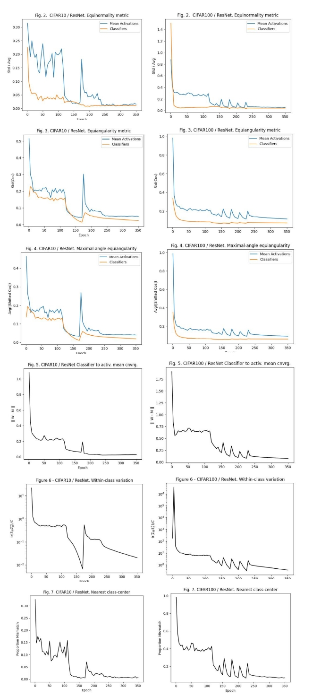

# Neuronal Collapse

This repository contains an unofficial implementation of the paper "[Prevalence of Neural Collapse During the Terminal Phase of Deep Learning Training](https://www.pnas.org/doi/full/10.1073/pnas.2015509117)" by Papyan, V., et al. (2020), published in *Proceedings of the National Academy of Sciences*, 117(40), 24652-24663.

## Overview

Neuronal Collapse (NC) refers to a phenomenon observed in deep learning where neural network representations align during the final stages of training. Reproducing this effect accurately requires careful adjustment of training parameters, including a class-balanced dataset, appropriate (or absence of) augmentation, learning rate scheduling, and specific network architectures. Different papers use various metrics to estimate NC, which may lead to different conclusions, especially in non-ideal collapse conditions.

This code accurately reproduces the experiments from the original paper on CIFAR-10 and CIFAR-100 datasets using ResNet-18 and ResNet-50 architectures, respectively, as suggested by the authors. It replicates Figures 2 through 7 from the paper.

## Requirements

This code has been tested under the following environment:

- `torch==1.13.1`
- `torchvision==0.14.1`

Ensure these dependencies are installed before running the code.

## Training the Network

To train the network and log checkpoints for NC estimation, run the following commands:

For CIFAR-10:
```bash
python train.py --dataset CIFAR10
```

For CIFAR-100:

```bash
python train.py --dataset CIFAR100
```

## Estimating Neuronal Collapse Metrics

Once the network is trained, you can estimate the neuronal collapse metrics using the following commands:

For CIFAR-10:

Once the network is trained, you can estimate the neuronal collapse metrics using the following commands:

For CIFAR-10:

```bash
python validate_nc.py --dataset CIFAR10
```

```bash
python validate_nc.py --dataset CIFAR100
```


## Results

Plots showing the collapse metrics, analogous to Figures 2 through 7 from the original paper, are saved in the `CIFAR10_plots/` and `CIFAR100_plots/` directories.



## References

- [Original Paper](https://www.pnas.org/doi/full/10.1073/pnas.2015509117): "Prevalence of Neural Collapse During the Terminal Phase of Deep Learning Training" by Papyan, V., et al. (2020)
